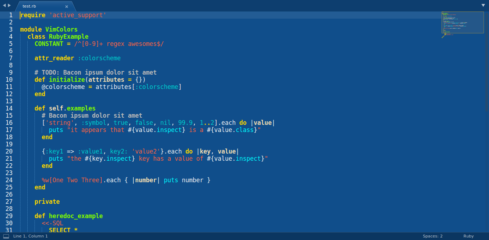

# Blue Mood for Sublime Text

This is a port of [emacs's Blue Mood theme](https://emacsthemes.com/themes/blue-mood-theme.html) for Sublime Text.

Keep in mind that this port doesn't correspond 100% to the original emacs theme, due to the differences between Sublime Text's theming system and emacs's theming system.

## Compatibility notice

This colorscheme comes in two versions, a `.sublime-color-scheme` version and a `.tmTheme` version. The former is compatible only with Sublime Text 3 build 3149 and above as the `.sublime-color-scheme` filetype it uses was introduced then. The latter is also compatible with older Sublime Text versions, but lacks some additional functionality introduced with the new filetype, and some fields will thus look slightly different. It is thus recommended that you use the `.sublime-color-scheme` version if your Sublime Text installation supports it.

## Installation

Manual only for the moment.

- Download the desired file.
- Go to the Packages folder on your system (by using `Preferences > Browse packages` from the main menu).
- Copy the colorscheme file under the `Packages/User` subfolder.

## Activation

Select `Preferences > Color scheme` from the main menu and choose the `Blue-Mood` colorscheme.

### Usage note

It is recommended to use the Adaptive UI theme alongside this colorscheme, as it adapts to its colors, and thus fits in quite well with it (as can also be seen in the screenshot). In case this isn't the default on your setup, select `Preferences > Theme` from the main menu and choose the `Adaptive.sublime-theme` UI theme.

### Credits

The initial structure for the `.sublime-color-scheme` file was largely based upon the default Monokai colorscheme (as can be seen [here](https://github.com/twolfson/sublime-files/blob/master/Packages/Color%20Scheme%20-%20Default/Monokai.sublime-color-scheme)). I used [convertacolor.com](https://convertacolor.com/) to understand which were the default colors of said colorscheme (as they were in hsl), so I could replace them with the colors of my own colorscheme.
The initial structure for the `.tmTheme` file was generated by the [tmThemeEditor](https://github.com/aziz/tmTheme-Editor).
 I also consulted the official Sublime Text documentation on [color schemes](https://www.sublimetext.com/docs/3/color_schemes.html), [.tmTheme color schemes](https://www.sublimetext.com/docs/3/color_schemes_tmtheme.html) and [scope naming](https://www.sublimetext.com/docs/3/scope_naming.html).
